# 动手学深度学习

[Course resources](https://courses.d2l.ai/zh-v2/)

Course author: 李沐

Note By: xuhaobit@gmail.com

#### C11：模型选择+过拟合和欠拟合

- 训练误差：模型在训练数据上的误差
- 泛化误差：模型在新数据上的误差
- 解决数据集很小，val不够的方法：
  - K-折交叉验证：
  - 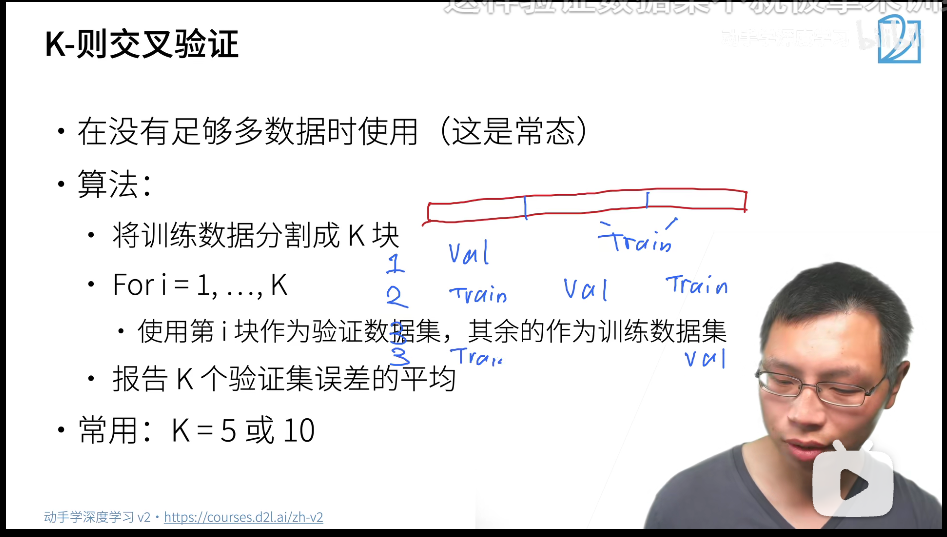
- 模型容量：
  - 低容量-->难以拟合训练数据；
  - 高容量-->记住所有训练数据

- 模型容量的估计：
  - 参数个数
  - 参数值的选择范围
- 数据复杂度：
  - 样本个数
  - 每个样本的元素个数
  - 时间、空间结构
  - 多样性


#### C12：权重衰退和Dropout

- 使用均方范数作为柔性限制以减少模型容量
  - 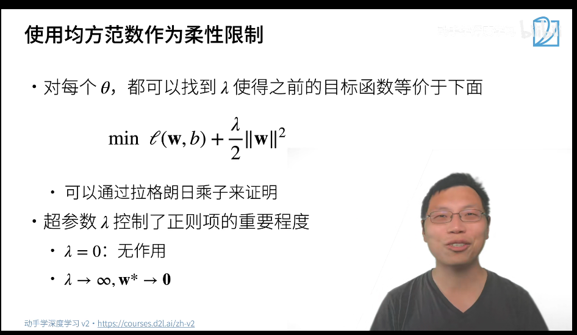
- 权重衰退
  - 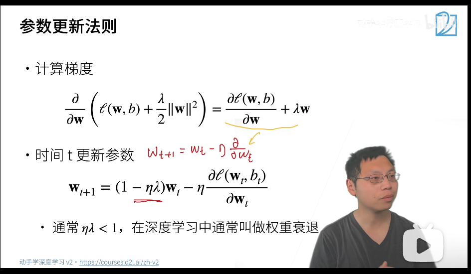
  - 每次更新时，wt会缩小一点，所以叫做权重衰退
- 总结
  - 权重衰退通过L2正则项使得模型参数不会过大，从而控制模型复杂度
  - 正则项（λ）权重是控制模型复杂度的超参数


- 丢弃法：
  - 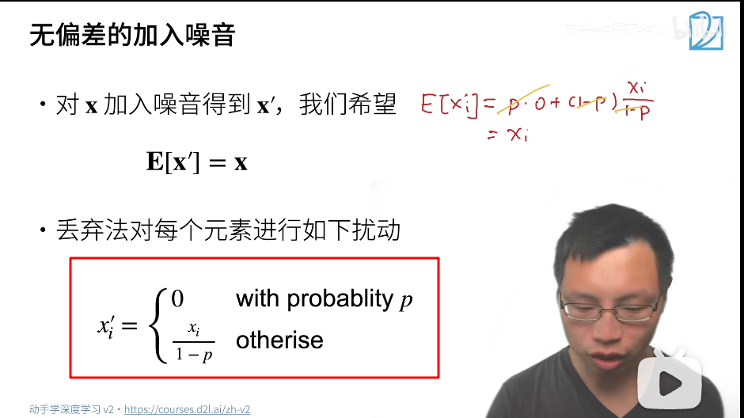
  - dropout是一个正则项，正则项只在训练的过程中使用（因为正则项是对权重产生影响）（在forward的时候，判断是不是train来对隐藏层进行dropout）
  - 总结：
    - dropout将一些输出项随机置0来控制模型复杂度
    - 常作用在多层感知机的隐藏层输出上
    - drop概率是控制模型复杂度的超参数


#### C14：数值稳定性+模型初始化和激活函数

- 数值稳定性
  - 数值稳定性常见的两个问题：
    1. 梯度爆炸：pow(1.5, 100) = 4e17
    2. 梯度消失：pow(0.8, 100) = 2e-10
  - 梯度爆炸原因
    - 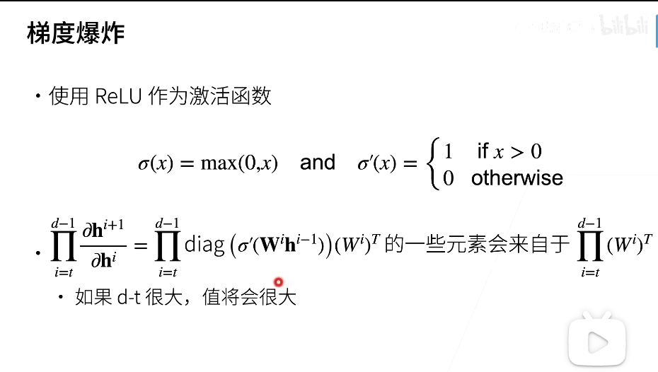
    - diag里面是0-1数值，所以元素值为ΠWi，可能爆炸
  - 梯度爆炸带来的问题：
    - 值超出值域(infinity)
      - 对于16位浮点数尤为严重
    - 对学习率敏感
      - 学习率大->大参数值->更大的梯度
      - 学习率小->训练无法进展
      - 导致在训练时不断调整学习率
  - 梯度消失的原因
    - 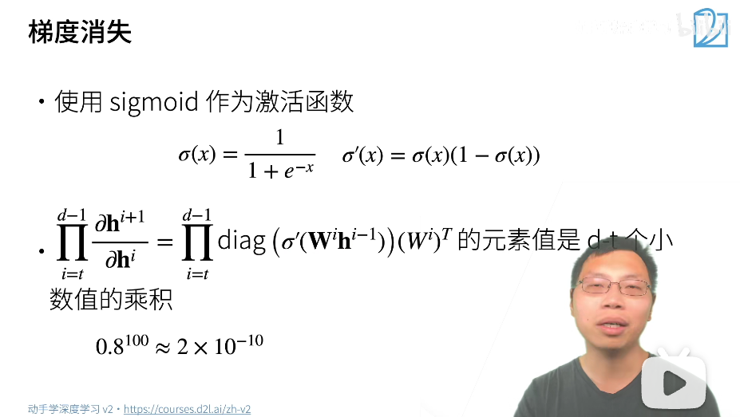
    - σ(x)当x输入很大时，值会很小，所以会梯度消失
  - 梯度消失的问题
    - 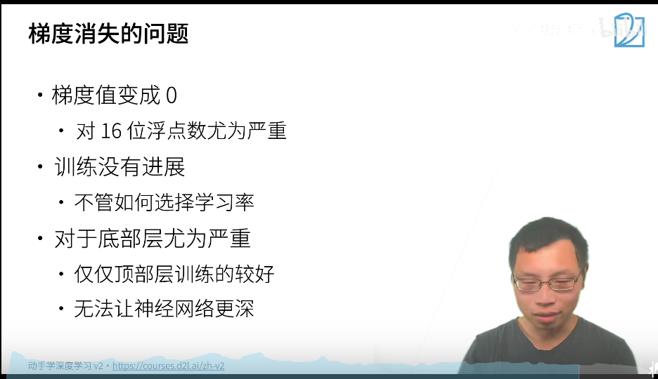
    - 这样深层网络的后几层参数都是0，那么就跟浅层网络一致了

- 模型初始化和激活函数
  - 让训练更加稳定：让梯度在一个合理的范围之内
    - 乘法变加法：ResNet, LSTM
    - 归一化：梯度归一化，梯度裁剪
    - 合理的激活函数和权重初始化
  - 合理的权重初始化
    - 目的是为了寻找一个权重初始化方法，经过许多层变换之后，权重和梯度都是一个E=0，D=const的数值情况
    - 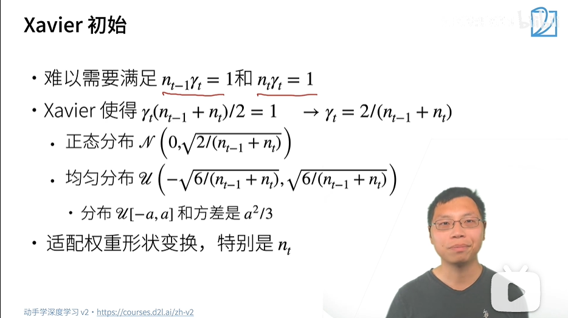
  - 合理的激活函数
    - 假设激活函数为f(x) = ax + b，经过计算得到a=1, b=0。
    - 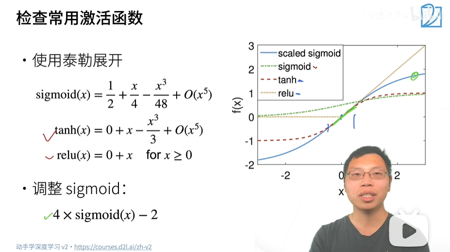
    - 可以看到常见的激活函数在0处泰勒展开后，可以发现tanh和relu与a=1, b=0的要求一致，从参数初始化方面解释了效果好；sigmod在经过变换之后也可以达到同等效果。
  - 总结
    - 合理的权重初始值和激活函数的选取可以提升数值稳定性


#### 5. 深度学习计算

- 参数访问

  - 以idx的类型可以访问具体层，state_dict可以访问参数

  - ```python
    print(type(net[2].bias))
    print(net[2].bias)
    print(net[2].bias.data)
    ```

  - ```python
    net.state_dict()['2.bias'].data
    ```

- 参数初始化

  - 本地替换的初始化函数

  - 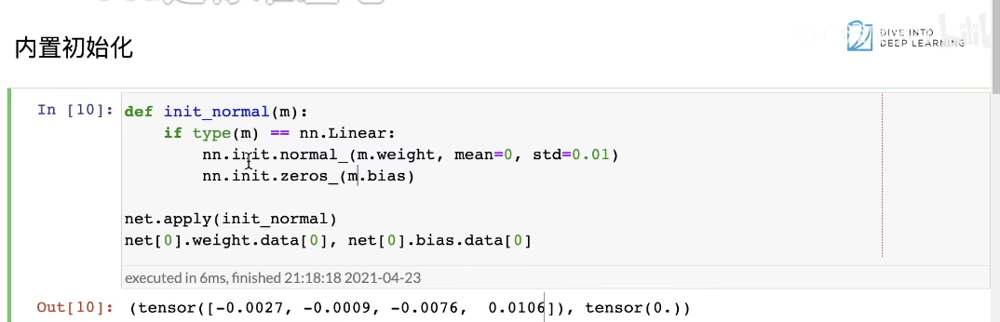
  
  - 先定义初始化函数，然后使用net.apply的方式（apply的含义是for net里面所有的block，应用apply的函数）
  
  - ```python
    def xavier(m):
        if type(m) == nn.Linear:
            nn.init.xavier_uniform_(m.weight)
    def init_42(m):
        if type(m) == nn.Linear:
            nn.init.constant_(m.weight, 42)
    
    net[0].apply(xavier)
    net[2].apply(init_42)
    print(net[0].weight.data[0])
    print(net[2].weight.data)
    ```


#### C16：读写文件

- 张量
  - torch.save(tensor, 'filename')
  - torch.load读取，比如res = torch.load('filename')
- 模型
  - torch.save(model.state_dict(), 'fname')
  - 加载参数之前，需要初始化一个同规模的模型，然后使用:new_model = torch.load('fname')将参数加载进去


#### C17：使用和购买GPU

- 方便请求GPU的函数

```python
def try_gpu(i=0):  #@save
    """如果存在，则返回gpu(i)，否则返回cpu()。"""
    if torch.cuda.device_count() >= i + 1:
        return torch.device(f'cuda:{i}')
    return torch.device('cpu')

def try_all_gpus():  #@save
    """返回所有可用的GPU，如果没有GPU，则返回[cpu(),]。"""
    devices = [torch.device(f'cuda:{i}')
             for i in range(torch.cuda.device_count())]
    return devices if devices else [torch.device('cpu')]

try_gpu(), try_gpu(10), try_all_gpus()
```

- 买GPU
  - 显存、计算能力、价格


#### C19：卷积

- 从全连接到卷积
  - 两个原则：平移不变性（找到同一个特征，不与位置相关。比如都是找到猫猫头的特征，在不同位置都可以找到）；局部性（只关注猫猫头，而不关注猫猫身体）
- 卷积
  - 利用平移不变性，没有必要为每一处(i, j)都记录一个v的权重，因此去除v的坐标属性，所有位置共享权重即可
  - 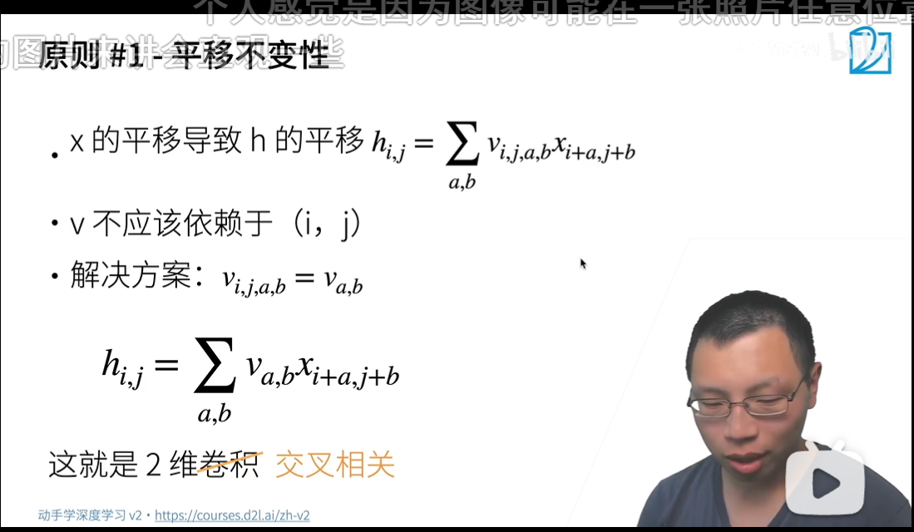
  - 局部性：卷积操作只应该与x一定范围的数据相关（Δ大小数据），因此卷积操作的范围是a,b∈(-Δ，Δ)
  - 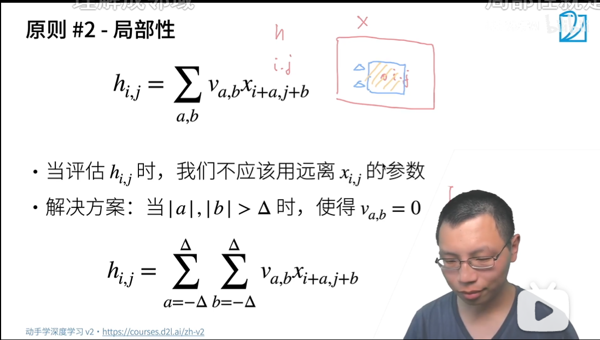

- 总结
  - 卷积层将输入和核矩阵进行交叉相关，加上偏移后得到输出
  - 核矩阵和便宜是可以学习的参数
  - 核矩阵大小是超参数

#### C20：卷积层的填充和步幅

- 总结
  - 填充和步幅是卷积层的超参数
  - 填充在输入周围添加额外的行/列，来控制输出形状的减少量
  - 步幅是每次滑动核窗口时的行/列的步长，可以成倍的减少输出形状（粗略的认为步幅是几，缩小几倍）


#### C21：多输入多输出通道

- 1x1卷积层
  - 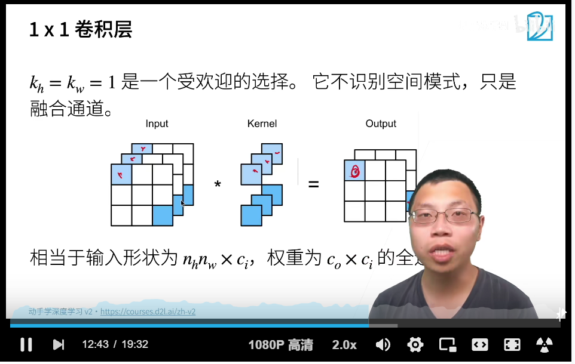
  - 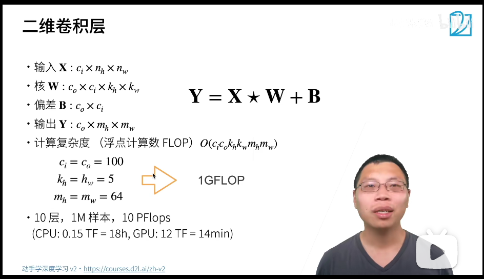
  - 1M样本，一次forward就要14min
- 池化层
  - 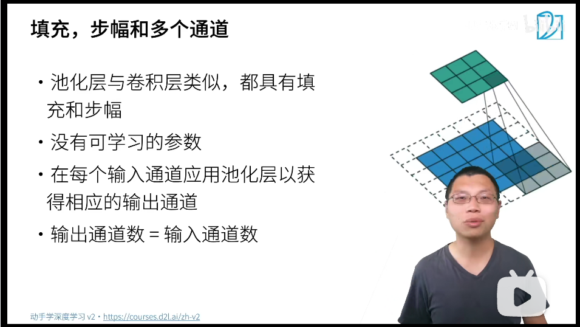
  - 不融合通道（交给卷积来操作）
  - 缓解卷积层会位置的敏感性


#### C24：深度卷积神经网络AlexNet

- AlexNet对比LeNet的主要改进
  - 丢弃法 Dropout
  - ReLu替换sigmod
  - MaxPooling替换AvgPooling
- 更多细节
  - 激活函数变成relu（梯度消失）
  - 隐藏全连接层后加入了丢弃层
  - 数据增强
- 复杂度
  - 参数个数：AlexNet比LeNet增加了10倍；
  - FLOP（每秒浮点运算次数）：AlexNet比LeNet增加了250倍（因为卷积是乘法多一点，所以规模增加是参数的平方）
- 总结
  - AlexNet是更大更深的LeNet
  - 新加入了丢弃法，ReLu，MaxPooling和数据增强


#### python：*的特殊含义，解包

https://zhuanlan.zhihu.com/p/33896402

